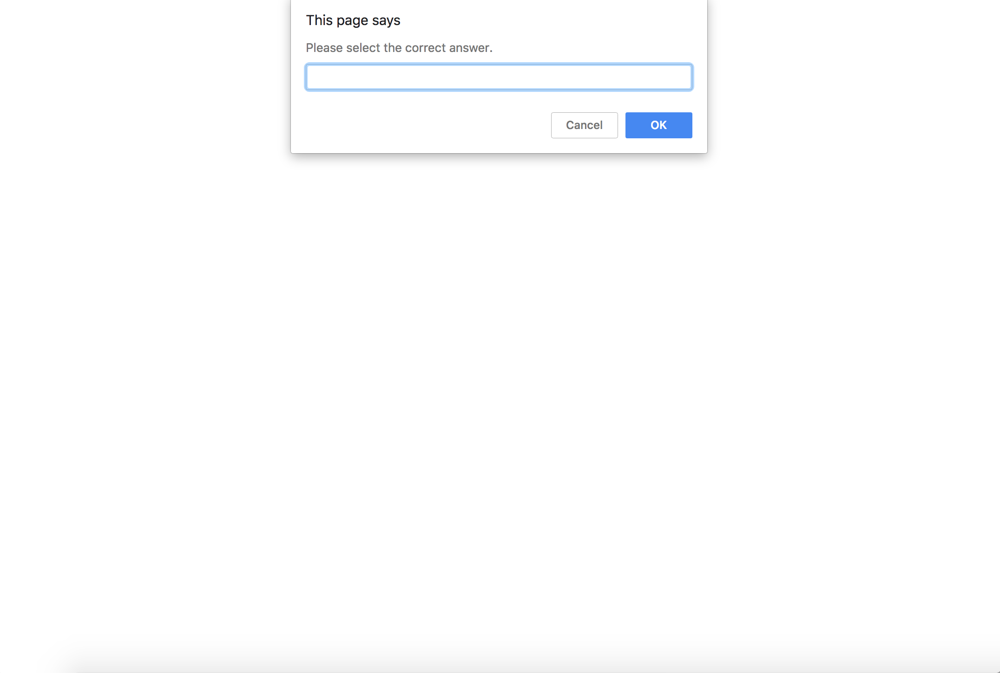

## Overview

The Survey app should be used to generate any online quizzes or surveys, but was also created for me to practice a few advanced concepts in JavaScript. The code involves immediately-invoked function expressions (IFFE) to ensure data security, which ensures that the code does not interfere with other code programmers' code so that the app can be used as a plugin. 

The app will build a function constructor called _Question_. This constructor will include a question, a list of options from which the user can choose, and a subsequent answer. The app will include a series of questions that will appear in the format of a prompt, and the user will then be given the chance to input his or her answer. If the user's response is correct, then the user will receive a message indicating whether the response is true or not. These questions and answers will be logged by the app for any future examination, as well. After the user receives a response about his or her answer, a new question will be displayed as a prompt until the user quits the survey by typing _exit_. A score has also implemented and logged in the console, which refers to the number of questions that have been answered correctly.

  

